# Fluxograma detalhado do funcionamento do projeto RAG

Fonte principal: codigo atual do projeto em `app/`.
Fonte auxiliar consultada: documentacao local em `C:\Users\gamer\Documents\Obsidian Vault\Documentacao\RAG`.

Este documento descreve o funcionamento observado no codigo. Quando houver ponto de atencao ou comportamento dependente de ambiente externo, isso aparece explicitamente em "Observacoes tecnicas".

## 1. Visao geral do sistema

O projeto implementa uma API FastAPI que recebe uma pergunta, executa um workflow LangGraph de RAG, busca documentos em uma collection Chroma Cloud, valida a relevancia do contexto e gera resposta com Gemini quando o contexto passa nos criterios definidos.

Tambem existe um fluxo separado de ingestao de documentos PDF, usado para carregar documentos no Chroma antes das perguntas serem feitas.

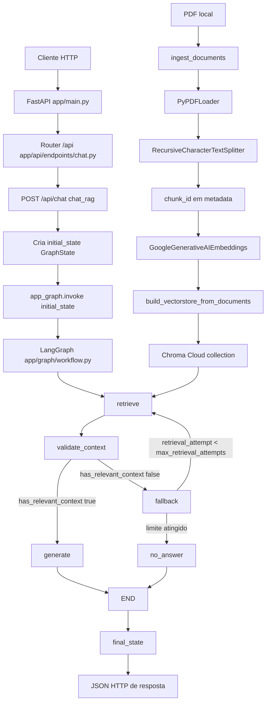
```mermaid
flowchart TD
    A[Cliente HTTP] --> B[FastAPI app/main.py]
    B --> C[Router /api app/api/endpoints/chat.py]
    C --> D[POST /api/chat chat_rag]
    D --> E[Cria initial_state GraphState]
    E --> F[app_graph.invoke initial_state]

    F --> G[LangGraph app/graph/workflow.py]
    G --> H[retrieve]
    H --> I[validate_context]
    I -->|has_relevant_context true| J[generate]
    I -->|has_relevant_context false| K[fallback]
    K -->|retrieval_attempt < max_retrieval_attempts| H
    K -->|limite atingido| L[no_answer]
    J --> M[END]
    L --> M
    M --> N[final_state]
    N --> O[JSON HTTP de resposta]

    P[PDF local] --> Q[ingest_documents]
    Q --> R[PyPDFLoader]
    R --> S[RecursiveCharacterTextSplitter]
    S --> T[chunk_id em metadata]
    T --> U[GoogleGenerativeAIEmbeddings]
    U --> V[build_vectorstore_from_documents]
    V --> W[Chroma Cloud collection]
    W --> H
```

## 2. Estrutura de arquivos

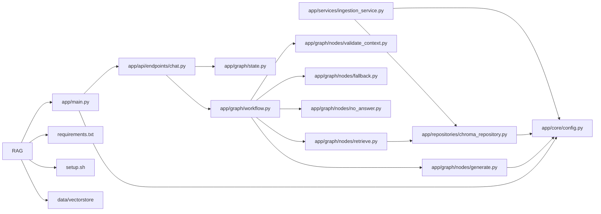
```mermaid
flowchart LR
    Root[RAG]
    Root --> Main[app/main.py]
    Root --> Requirements[requirements.txt]
    Root --> Setup[setup.sh]
    Root --> Data[data/vectorstore]

    Main --> API[app/api/endpoints/chat.py]
    Main --> Core[app/core/config.py]

    API --> State[app/graph/state.py]
    API --> Workflow[app/graph/workflow.py]

    Workflow --> Retrieve[app/graph/nodes/retrieve.py]
    Workflow --> Validate[app/graph/nodes/validate_context.py]
    Workflow --> Fallback[app/graph/nodes/fallback.py]
    Workflow --> Generate[app/graph/nodes/generate.py]
    Workflow --> NoAnswer[app/graph/nodes/no_answer.py]

    Retrieve --> Repo[app/repositories/chroma_repository.py]
    Generate --> Core
    Repo --> Core

    Ingest[app/services/ingestion_service.py] --> Repo
    Ingest --> Core
```

## 3. Fluxo HTTP principal

Entrada real:

- Metodo: `POST`
- Caminho final: `/api/chat`
- Parametro recebido pela funcao: `question: str`
- Arquivo: `app/api/endpoints/chat.py`
- Funcao: `chat_rag`

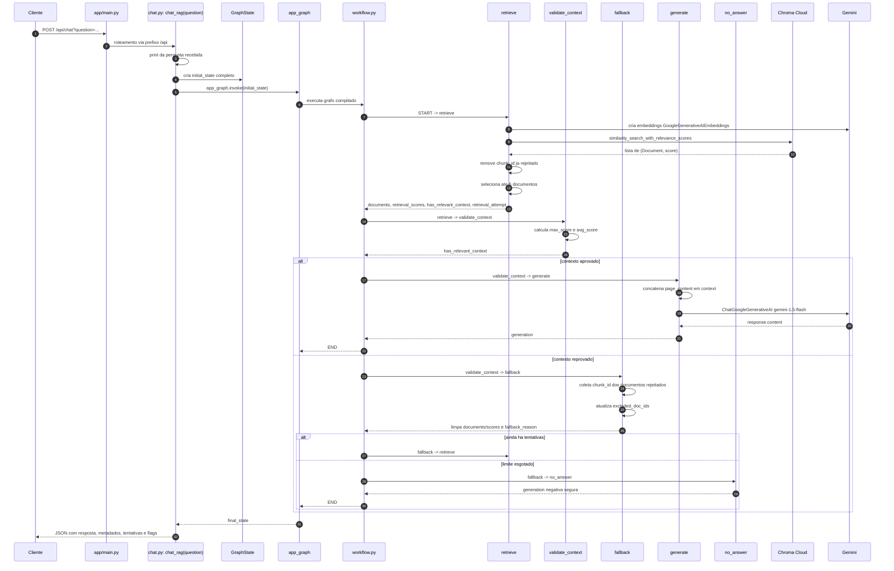
```mermaid
sequenceDiagram
    autonumber
    participant Client as Cliente
    participant Main as app/main.py
    participant Chat as chat.py: chat_rag(question)
    participant State as GraphState
    participant Graph as app_graph
    participant Workflow as workflow.py
    participant Retrieve as retrieve
    participant Validate as validate_context
    participant Fallback as fallback
    participant Generate as generate
    participant NoAnswer as no_answer
    participant Chroma as Chroma Cloud
    participant Gemini as Gemini

    Client->>Main: POST /api/chat?question=...
    Main->>Chat: roteamento via prefixo /api
    Chat->>Chat: print da pergunta recebida
    Chat->>State: cria initial_state completo
    Chat->>Graph: app_graph.invoke(initial_state)
    Graph->>Workflow: executa grafo compilado
    Workflow->>Retrieve: START -> retrieve
    Retrieve->>Gemini: cria embeddings GoogleGenerativeAIEmbeddings
    Retrieve->>Chroma: similarity_search_with_relevance_scores
    Chroma-->>Retrieve: lista de (Document, score)
    Retrieve->>Retrieve: remove chunk_id ja rejeitado
    Retrieve->>Retrieve: seleciona ate 6 documentos
    Retrieve-->>Workflow: documents, retrieval_scores, has_relevant_context, retrieval_attempt
    Workflow->>Validate: retrieve -> validate_context
    Validate->>Validate: calcula max_score e avg_score
    Validate-->>Workflow: has_relevant_context
    alt contexto aprovado
        Workflow->>Generate: validate_context -> generate
        Generate->>Generate: concatena page_content em context
        Generate->>Gemini: ChatGoogleGenerativeAI gemini-1.5-flash
        Gemini-->>Generate: response.content
        Generate-->>Workflow: generation
        Workflow-->>Graph: END
    else contexto reprovado
        Workflow->>Fallback: validate_context -> fallback
        Fallback->>Fallback: coleta chunk_id dos documentos rejeitados
        Fallback->>Fallback: atualiza excluded_doc_ids
        Fallback-->>Workflow: limpa documents/scores e fallback_reason
        alt ainda ha tentativas
            Workflow->>Retrieve: fallback -> retrieve
        else limite esgotado
            Workflow->>NoAnswer: fallback -> no_answer
            NoAnswer-->>Workflow: generation negativa segura
            Workflow-->>Graph: END
        end
    end
    Graph-->>Chat: final_state
    Chat-->>Client: JSON com resposta, metadados, tentativas e flags
```

## 4. Estado compartilhado do LangGraph

Arquivo: `app/graph/state.py`

Classe: `GraphState(TypedDict)`

Campos:

| Campo | Tipo | Papel no fluxo |
|---|---:|---|
| `question` | `str` | Pergunta original recebida pela API. |
| `documents` | `List[Document]` | Documentos recuperados do vector store e aprovados/rejeitados pelo fluxo. |
| `retrieval_scores` | `List[float]` | Scores de relevancia retornados pelo Chroma/LangChain. |
| `generation` | `str` | Resposta final gerada pelo LLM ou pelo no `no_answer`. |
| `has_relevant_context` | `bool` | Flag que decide se o grafo vai para `generate` ou `fallback`. |
| `excluded_doc_ids` | `List[str]` | IDs de chunks rejeitados para nao repetir o mesmo contexto em novas tentativas. |
| `retrieval_attempt` | `int` | Contador de buscas realizadas. |
| `max_retrieval_attempts` | `int` | Limite maximo de tentativas antes de cair em `no_answer`. |
| `fallback_reason` | `str` | Motivo registrado quando o fallback e acionado. |

Fluxo de mutacao do estado:

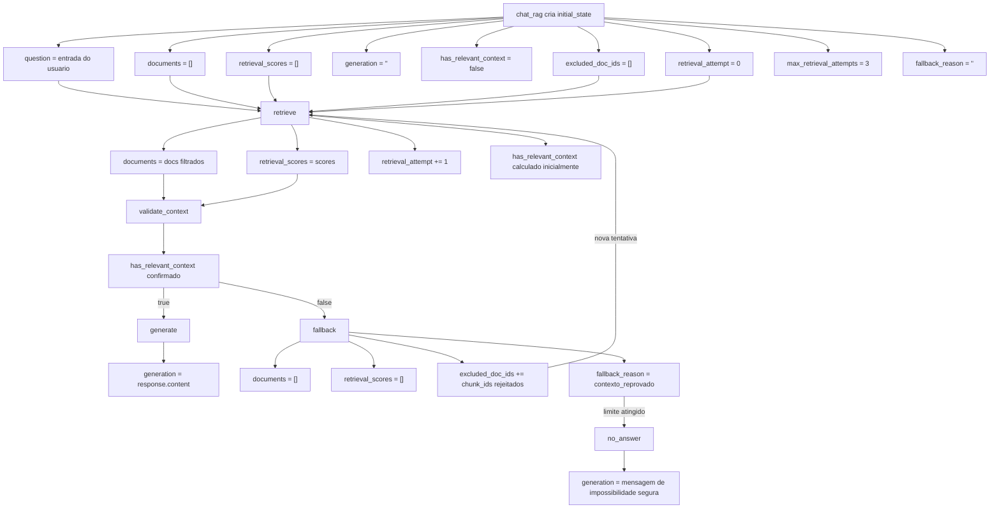
```mermaid
flowchart TD
    A[chat_rag cria initial_state] --> B["question = entrada do usuario"]
    A --> C["documents = []"]
    A --> D["retrieval_scores = []"]
    A --> E["generation = ''"]
    A --> F["has_relevant_context = false"]
    A --> G["excluded_doc_ids = []"]
    A --> H["retrieval_attempt = 0"]
    A --> I["max_retrieval_attempts = 3"]
    A --> J["fallback_reason = ''"]

    B --> K[retrieve]
    C --> K
    D --> K
    G --> K
    H --> K

    K --> L["documents = docs filtrados"]
    K --> M["retrieval_scores = scores"]
    K --> N["retrieval_attempt += 1"]
    K --> O["has_relevant_context calculado inicialmente"]

    L --> P[validate_context]
    M --> P
    P --> Q["has_relevant_context confirmado"]

    Q -->|true| R[generate]
    R --> S["generation = response.content"]

    Q -->|false| T[fallback]
    T --> U["documents = []"]
    T --> V["retrieval_scores = []"]
    T --> W["excluded_doc_ids += chunk_ids rejeitados"]
    T --> X["fallback_reason = contexto_reprovado"]

    W -->|nova tentativa| K
    X -->|limite atingido| Y[no_answer]
    Y --> Z["generation = mensagem de impossibilidade segura"]
```

## 5. Grafo LangGraph

Arquivo: `app/graph/workflow.py`

Objetos e chamadas principais:

- `workflow = StateGraph(GraphState)`
- `workflow.add_node("retrieve", retrieve)`
- `workflow.add_node("generate", generate)`
- `workflow.add_node("validate_context", validate_context)`
- `workflow.add_node("fallback", fallback)`
- `workflow.add_node("no_answer", no_answer)`
- `workflow.add_edge(START, "retrieve")`
- `workflow.add_edge("retrieve", "validate_context")`
- `workflow.add_conditional_edges("validate_context", ...)`
- `workflow.add_conditional_edges("fallback", ...)`
- `workflow.add_edge("generate", END)`
- `workflow.add_edge("no_answer", END)`
- `app_graph = workflow.compile()`

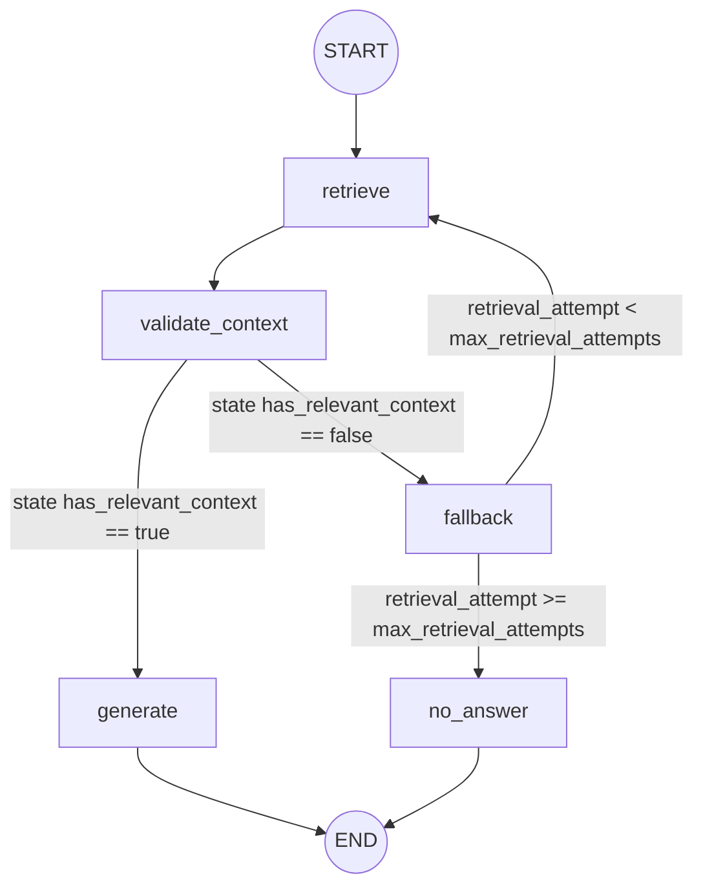
```mermaid
flowchart TD
    START((START)) --> Retrieve[retrieve]
    Retrieve --> Validate[validate_context]
    Validate -->|state has_relevant_context == true| Generate[generate]
    Validate -->|state has_relevant_context == false| Fallback[fallback]
    Fallback -->|retrieval_attempt < max_retrieval_attempts| Retrieve
    Fallback -->|retrieval_attempt >= max_retrieval_attempts| NoAnswer[no_answer]
    Generate --> END((END))
    NoAnswer --> END
```

Detalhe das condicoes:

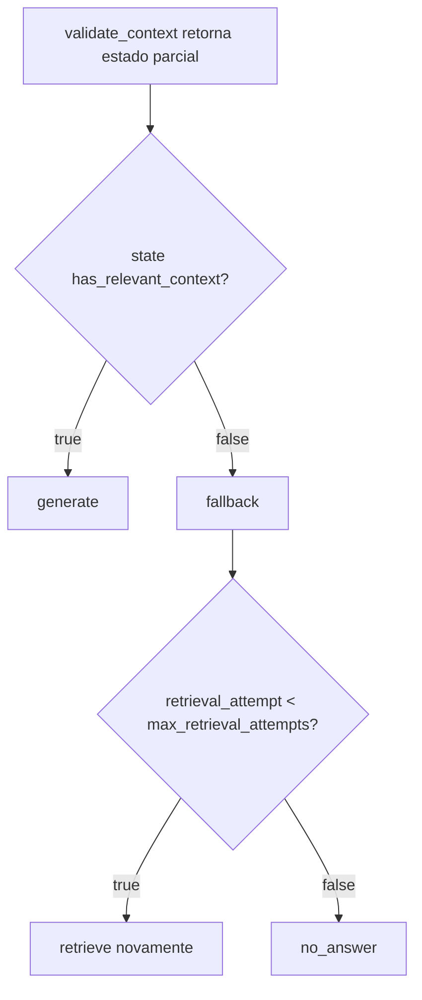
```mermaid
flowchart TD
    A[validate_context retorna estado parcial] --> B{state has_relevant_context?}
    B -->|true| C[generate]
    B -->|false| D[fallback]

    D --> E{retrieval_attempt < max_retrieval_attempts?}
    E -->|true| F[retrieve novamente]
    E -->|false| G[no_answer]
```

## 6. Fluxo do no retrieve

Arquivo: `app/graph/nodes/retrieve.py`

Funcao: `retrieve(state: GraphState)`

Responsabilidade: recuperar documentos relevantes do Chroma Cloud usando embeddings Gemini, filtrar chunks ja rejeitados e retornar documentos, scores e metadados de controle.

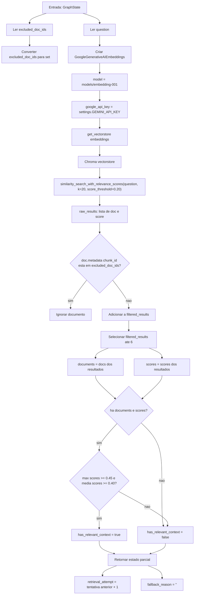
```mermaid
flowchart TD
    A[Entrada: GraphState] --> B[Ler question]
    A --> C[Ler excluded_doc_ids]
    C --> D[Converter excluded_doc_ids para set]
    B --> E[Criar GoogleGenerativeAIEmbeddings]
    E --> F["model = models/embedding-001"]
    F --> G["google_api_key = settings.GEMINI_API_KEY"]
    G --> H[get_vectorstore embeddings]
    H --> I[Chroma vectorstore]
    I --> J["similarity_search_with_relevance_scores(question, k=20, score_threshold=0.20)"]
    J --> K[raw_results: lista de doc e score]
    K --> L{doc.metadata chunk_id esta em excluded_doc_ids?}
    L -->|sim| M[Ignorar documento]
    L -->|nao| N[Adicionar a filtered_results]
    N --> O[Selecionar filtered_results ate 6]
    O --> P[documents = docs dos resultados]
    O --> Q[scores = scores dos resultados]
    P --> R{ha documents e scores?}
    Q --> R
    R -->|nao| S[has_relevant_context = false]
    R -->|sim| T{max scores >= 0.45 e media scores >= 0.40?}
    T -->|sim| U[has_relevant_context = true]
    T -->|nao| S
    U --> V[Retornar estado parcial]
    S --> V
    V --> W["retrieval_attempt = tentativa anterior + 1"]
    V --> X["fallback_reason = ''"]
```

Retorno da funcao:

| Chave retornada | Origem |
|---|---|
| `documents` | Lista de ate 6 documentos filtrados. |
| `retrieval_scores` | Scores correspondentes aos documentos retornados. |
| `question` | Mesma pergunta recebida no estado. |
| `has_relevant_context` | Resultado de `len > 0`, `max >= 0.45`, `media >= 0.40`. |
| `retrieval_attempt` | `state.get("retrieval_attempt", 0) + 1`. |
| `fallback_reason` | String vazia, resetada apos nova busca. |

## 7. Fluxo do no validate_context

Arquivo: `app/graph/nodes/validate_context.py`

Funcao: `validate_context(state: GraphState)`

Responsabilidade: confirmar se o conjunto de documentos e scores e suficiente para seguir para geracao.

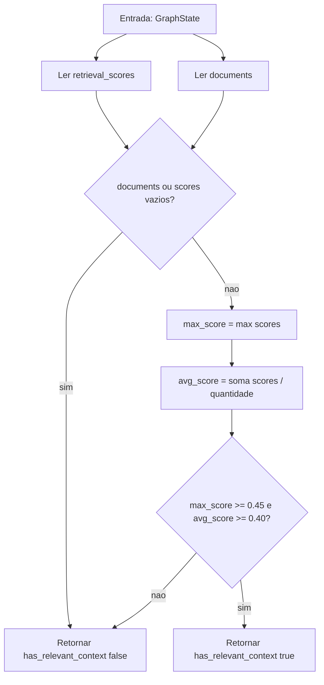
```mermaid
flowchart TD
    A[Entrada: GraphState] --> B[Ler retrieval_scores]
    A --> C[Ler documents]
    B --> D{documents ou scores vazios?}
    C --> D
    D -->|sim| E[Retornar has_relevant_context false]
    D -->|nao| F[max_score = max scores]
    F --> G[avg_score = soma scores / quantidade]
    G --> H{max_score >= 0.45 e avg_score >= 0.40?}
    H -->|sim| I[Retornar has_relevant_context true]
    H -->|nao| E
```

Observacao: esta funcao repete a regra de validacao ja aplicada em `retrieve`. No desenho atual isso funciona como confirmacao dedicada antes de `generate`.

## 8. Fluxo do no fallback

Arquivo: `app/graph/nodes/fallback.py`

Funcao: `fallback(state: GraphState)`

Responsabilidade: rejeitar logicamente o lote atual de documentos e preparar uma nova tentativa de retrieval sem repetir os mesmos chunks.

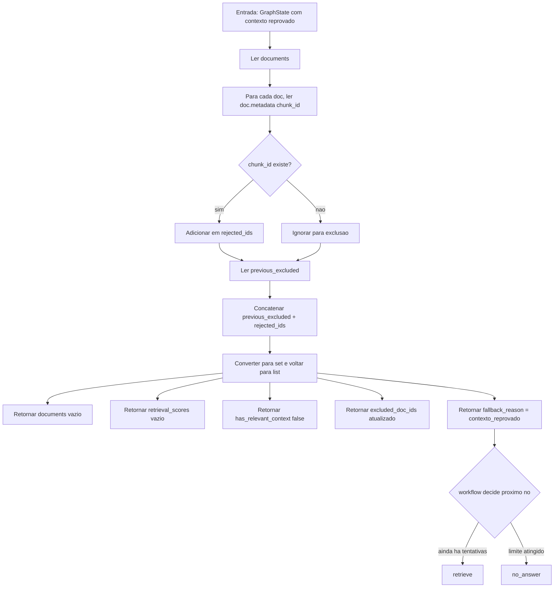
```mermaid
flowchart TD
    A[Entrada: GraphState com contexto reprovado] --> B[Ler documents]
    B --> C[Para cada doc, ler doc.metadata chunk_id]
    C --> D{chunk_id existe?}
    D -->|sim| E[Adicionar em rejected_ids]
    D -->|nao| F[Ignorar para exclusao]
    E --> G[Ler previous_excluded]
    F --> G
    G --> H[Concatenar previous_excluded + rejected_ids]
    H --> I[Converter para set e voltar para list]
    I --> J[Retornar documents vazio]
    I --> K[Retornar retrieval_scores vazio]
    I --> L[Retornar has_relevant_context false]
    I --> M[Retornar excluded_doc_ids atualizado]
    I --> N["Retornar fallback_reason = contexto_reprovado"]
    N --> O{workflow decide proximo no}
    O -->|ainda ha tentativas| P[retrieve]
    O -->|limite atingido| Q[no_answer]
```

Retorno da funcao:

| Chave retornada | Valor |
|---|---|
| `documents` | `[]` |
| `retrieval_scores` | `[]` |
| `has_relevant_context` | `False` |
| `excluded_doc_ids` | Lista unica de IDs rejeitados anteriormente + IDs atuais. |
| `fallback_reason` | `"contexto_reprovado"` |

## 9. Fluxo do no generate

Arquivo: `app/graph/nodes/generate.py`

Funcao: `generate(state: GraphState)`

Responsabilidade: montar o contexto textual com os documentos aprovados, construir o prompt RAG e gerar a resposta com Gemini.

```mermaid
flowchart TD
    A[Entrada: GraphState aprovado] --> B[Ler question]
    A --> C[Ler documents]
    C --> D[Extrair doc.page_content de cada documento]
    D --> E[Unir conteudos com duas quebras de linha]
    E --> F[context]
    B --> G[template RAG]
    F --> G
    G --> H[ChatPromptTemplate.from_template]
    H --> I[Criar ChatGoogleGenerativeAI]
    I --> J["model = gemini-1.5-flash"]
    I --> K["google_api_key = settings.GEMINI_API_KEY"]
    I --> L["temperature = 0.7"]
    H --> M[Criar chain prompt | llm]
    I --> M
    M --> N["invoke com context e question"]
    N --> O[response.content]
    O --> P[Retornar generation]
```

Prompt usado no codigo:

```text
Voce e um assistente especializado em responder perguntas com base em documentos tecnicos.
Use APENAS o contexto fornecido abaixo para responder a pergunta.
Se a resposta nao estiver no contexto, diga apenas que nao tem informacao suficiente.
Seja preciso e profissional.
```

Retorno da funcao:

| Chave retornada | Valor |
|---|---|
| `generation` | `response.content` retornado pelo modelo Gemini. |

## 10. Fluxo do no no_answer

Arquivo: `app/graph/nodes/no_answer.py`

Funcao: `no_answer(state: GraphState)`

Responsabilidade: encerrar o fluxo com resposta segura quando o sistema esgota as tentativas de retrieval sem aprovar contexto.

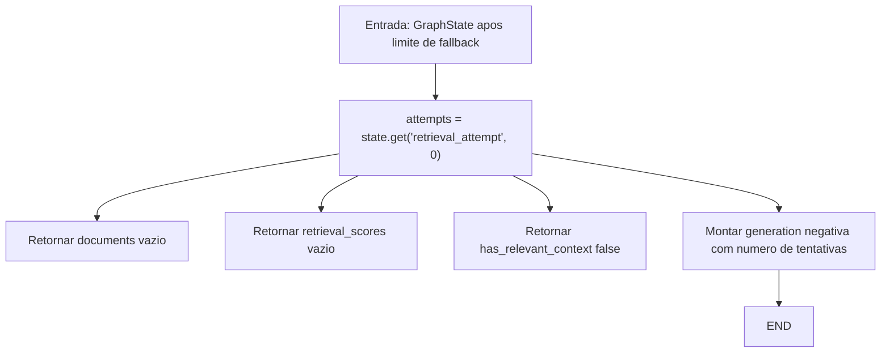
```mermaid
flowchart TD
    A[Entrada: GraphState apos limite de fallback] --> B["attempts = state.get('retrieval_attempt', 0)"]
    B --> C[Retornar documents vazio]
    B --> D[Retornar retrieval_scores vazio]
    B --> E[Retornar has_relevant_context false]
    B --> F[Montar generation negativa com numero de tentativas]
    F --> G[END]
```

Mensagem retornada:

```text
Nao encontrei contexto suficientemente relevante para responder com seguranca apos {attempts} tentativas de busca.
```

## 11. Fluxo da API FastAPI

Arquivo: `app/main.py`

Funcoes/objetos:

- `app = FastAPI(title=settings.PROJECT_NAME)`
- `app.include_router(chat_router, prefix="/api")`
- `read_root()`

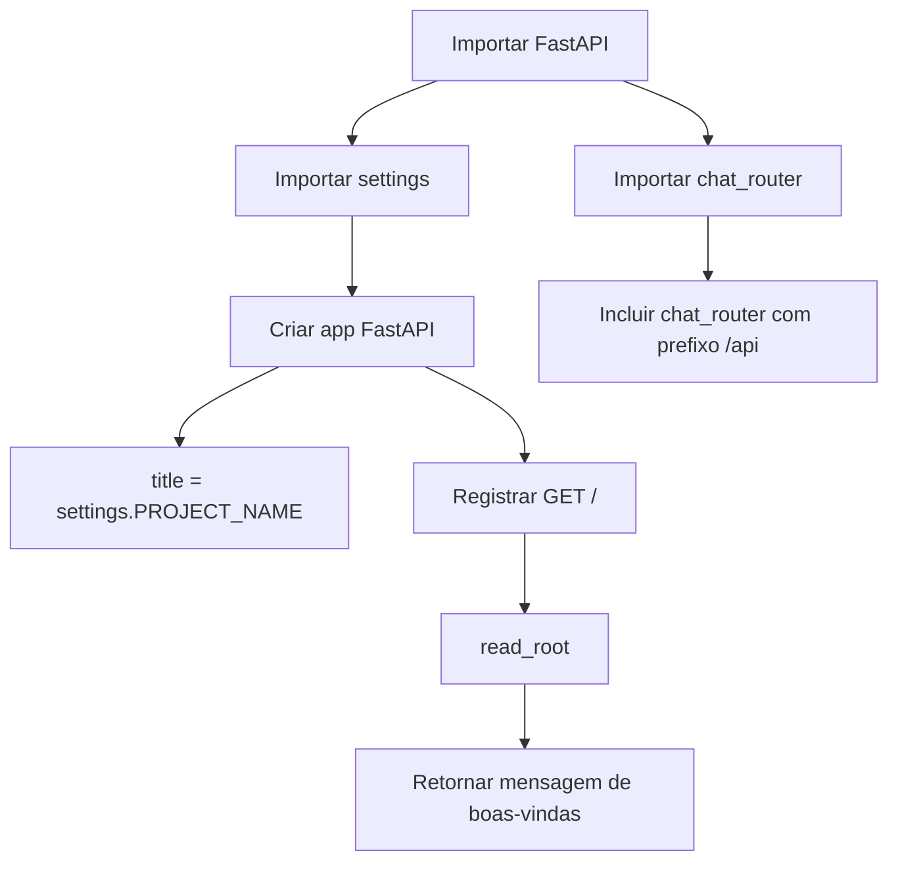
```mermaid
flowchart TD
    A[Importar FastAPI] --> B[Importar chat_router]
    A --> C[Importar settings]
    C --> D[Criar app FastAPI]
    D --> E["title = settings.PROJECT_NAME"]
    B --> F[Incluir chat_router com prefixo /api]
    D --> G[Registrar GET /]
    G --> H[read_root]
    H --> I[Retornar mensagem de boas-vindas]
```

Arquivo: `app/api/endpoints/chat.py`

Funcao: `chat_rag(question: str)`

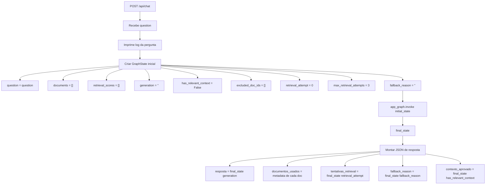
```mermaid
flowchart TD
    A[POST /api/chat] --> B[Recebe question]
    B --> C[Imprime log da pergunta]
    C --> D[Criar GraphState inicial]
    D --> E["question = question"]
    D --> F["documents = []"]
    D --> G["retrieval_scores = []"]
    D --> H["generation = ''"]
    D --> I["has_relevant_context = False"]
    D --> J["excluded_doc_ids = []"]
    D --> K["retrieval_attempt = 0"]
    D --> L["max_retrieval_attempts = 3"]
    D --> M["fallback_reason = ''"]
    M --> N[app_graph.invoke initial_state]
    N --> O[final_state]
    O --> P[Montar JSON de resposta]
    P --> Q["resposta = final_state generation"]
    P --> R["documentos_usados = metadata de cada doc"]
    P --> S["tentativas_retrieval = final_state retrieval_attempt"]
    P --> T["fallback_reason = final_state fallback_reason"]
    P --> U["contexto_aprovado = final_state has_relevant_context"]
```

Resposta JSON:

| Campo | Origem |
|---|---|
| `resposta` | `final_state["generation"]` |
| `documentos_usados` | `[doc.metadata for doc in final_state["documents"]]` |
| `tentativas_retrieval` | `final_state["retrieval_attempt"]` |
| `fallback_reason` | `final_state["fallback_reason"]` |
| `contexto_aprovado` | `final_state["has_relevant_context"]` |

## 12. Fluxo de configuracao

Arquivo: `app/core/config.py`

Classe: `Settings(BaseSettings)`

Responsabilidade: carregar variaveis de ambiente e expor configuracoes para Gemini e Chroma Cloud.

Campos:

| Campo | Origem/alias | Obrigatorio | Uso |
|---|---|---:|---|
| `PROJECT_NAME` | valor default `"LangGraph RAG"` | nao | Titulo da API FastAPI. |
| `GEMINI_API_KEY` | `GEMINI_API_KEY` | sim | Embeddings e LLM Gemini. |
| `CHROMA_API_KEY` | `CHROMA_API_KEY` ou `CHROMA_DB_KEY` | sim | Autenticacao Chroma Cloud. |
| `CHROMA_TENANT` | `CHROMA_TENANT` ou `TENANT` | sim | Tenant Chroma Cloud. |
| `CHROMA_DATABASE` | `CHROMA_DATABASE` ou `DATABASE` | sim | Database Chroma Cloud. |
| `CHROMA_COLLECTION_NAME` | `CHROMA_COLLECTION_NAME` | nao, default `rag_documents` | Nome da collection. |

Funcao: `get_chroma_client() -> chromadb.ClientAPI`

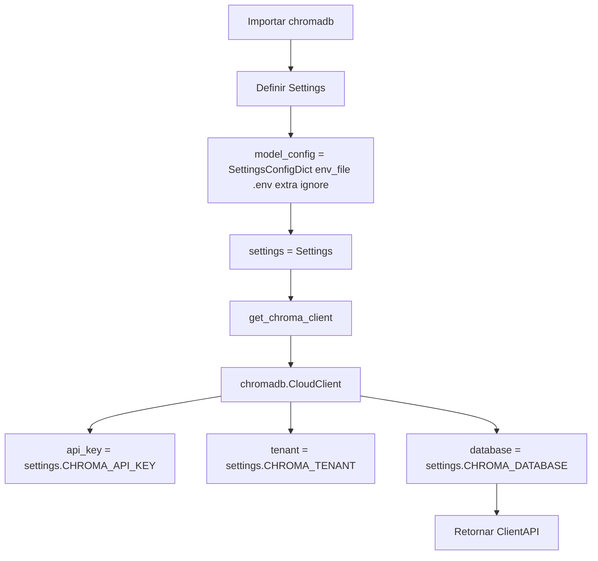
```mermaid
flowchart TD
    A[Importar chromadb] --> B[Definir Settings]
    B --> C["model_config = SettingsConfigDict env_file .env extra ignore"]
    C --> D[settings = Settings]
    D --> E[get_chroma_client]
    E --> F[chromadb.CloudClient]
    F --> G["api_key = settings.CHROMA_API_KEY"]
    F --> H["tenant = settings.CHROMA_TENANT"]
    F --> I["database = settings.CHROMA_DATABASE"]
    I --> J[Retornar ClientAPI]
```

Observacao tecnica: existe tambem uma funcao `get_chroma_client` em `app/repositories/chroma_repository.py` com o mesmo nome, mas implementada com cache global. No fluxo de retrieval e ingestao, a funcao usada diretamente e a do repository.

## 13. Fluxo do repository Chroma

Arquivo: `app/repositories/chroma_repository.py`

Variaveis globais:

- `_client: ClientAPI | None = None`
- `_collection: Collection | None = None`

Funcao: `get_chroma_client() -> ClientAPI`

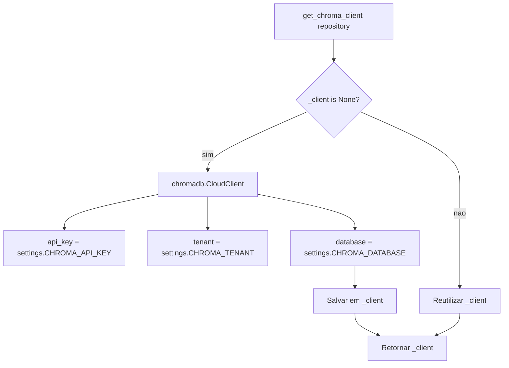
```mermaid
flowchart TD
    A[get_chroma_client repository] --> B{_client is None?}
    B -->|sim| C[chromadb.CloudClient]
    C --> D["api_key = settings.CHROMA_API_KEY"]
    C --> E["tenant = settings.CHROMA_TENANT"]
    C --> F["database = settings.CHROMA_DATABASE"]
    F --> G[Salvar em _client]
    B -->|nao| H[Reutilizar _client]
    G --> I[Retornar _client]
    H --> I
```

Funcao: `get_chroma_collection(client: ClientAPI = Depends(get_chroma_client)) -> Collection`

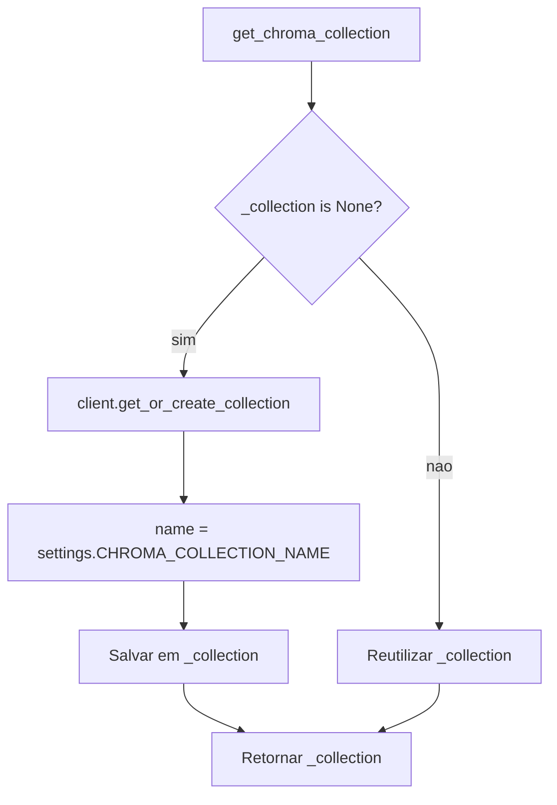
```mermaid
flowchart TD
    A[get_chroma_collection] --> B{_collection is None?}
    B -->|sim| C[client.get_or_create_collection]
    C --> D["name = settings.CHROMA_COLLECTION_NAME"]
    D --> E[Salvar em _collection]
    B -->|nao| F[Reutilizar _collection]
    E --> G[Retornar _collection]
    F --> G
```

Funcao: `get_vectorstore(embeddings: Embeddings) -> Chroma`

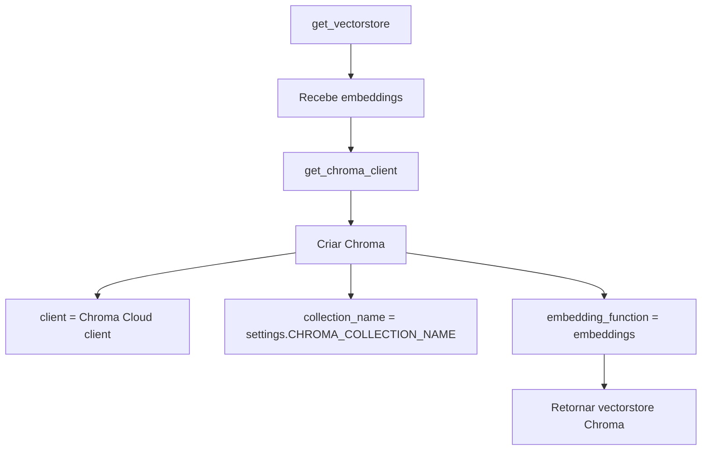
```mermaid
flowchart TD
    A[get_vectorstore] --> B[Recebe embeddings]
    B --> C[get_chroma_client]
    C --> D[Criar Chroma]
    D --> E["client = Chroma Cloud client"]
    D --> F["collection_name = settings.CHROMA_COLLECTION_NAME"]
    D --> G["embedding_function = embeddings"]
    G --> H[Retornar vectorstore Chroma]
```

Funcao: `build_vectorstore_from_documents(documents, embeddings: Embeddings) -> Chroma`

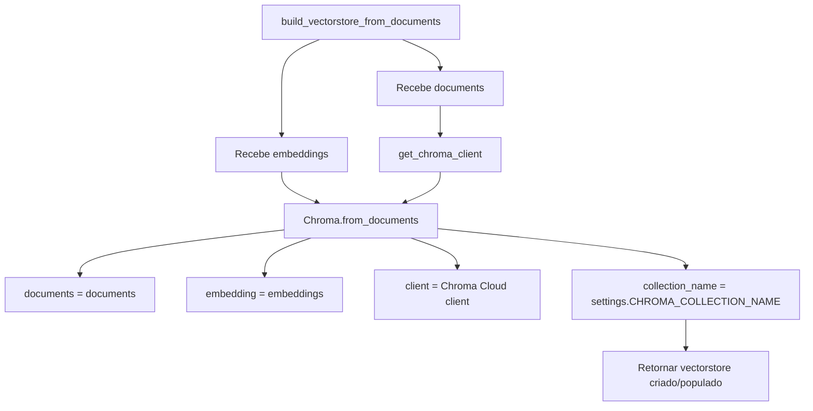
```mermaid
flowchart TD
    A[build_vectorstore_from_documents] --> B[Recebe documents]
    A --> C[Recebe embeddings]
    B --> D[get_chroma_client]
    C --> E[Chroma.from_documents]
    D --> E
    E --> F["documents = documents"]
    E --> G["embedding = embeddings"]
    E --> H["client = Chroma Cloud client"]
    E --> I["collection_name = settings.CHROMA_COLLECTION_NAME"]
    I --> J[Retornar vectorstore criado/populado]
```

## 14. Fluxo de ingestao de documentos

Arquivo: `app/services/ingestion_service.py`

Funcao: `ingest_documents(pdf_path: str)`

Responsabilidade: ler um PDF, transformar paginas em chunks, enriquecer metadata com `chunk_id`, gerar embeddings e persistir no Chroma Cloud.

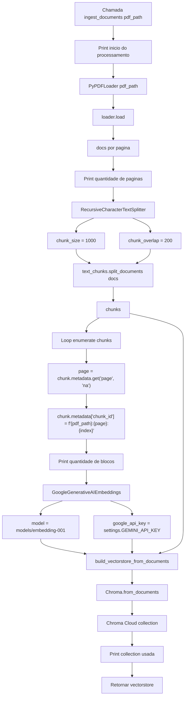
```mermaid
flowchart TD
    A[Chamada ingest_documents pdf_path] --> B[Print inicio do processamento]
    B --> C[PyPDFLoader pdf_path]
    C --> D[loader.load]
    D --> E[docs por pagina]
    E --> F[Print quantidade de paginas]
    F --> G[RecursiveCharacterTextSplitter]
    G --> H["chunk_size = 1000"]
    G --> I["chunk_overlap = 200"]
    H --> J[text_chunks.split_documents docs]
    I --> J
    J --> K[chunks]
    K --> L[Loop enumerate chunks]
    L --> M["page = chunk.metadata.get('page', 'na')"]
    M --> N["chunk.metadata['chunk_id'] = f'{pdf_path}:{page}:{index}'"]
    N --> O[Print quantidade de blocos]
    O --> P[GoogleGenerativeAIEmbeddings]
    P --> Q["model = models/embedding-001"]
    P --> R["google_api_key = settings.GEMINI_API_KEY"]
    Q --> S[build_vectorstore_from_documents]
    R --> S
    K --> S
    S --> T[Chroma.from_documents]
    T --> U[Chroma Cloud collection]
    U --> V[Print collection usada]
    V --> W[Retornar vectorstore]
```

Bloco executavel direto:

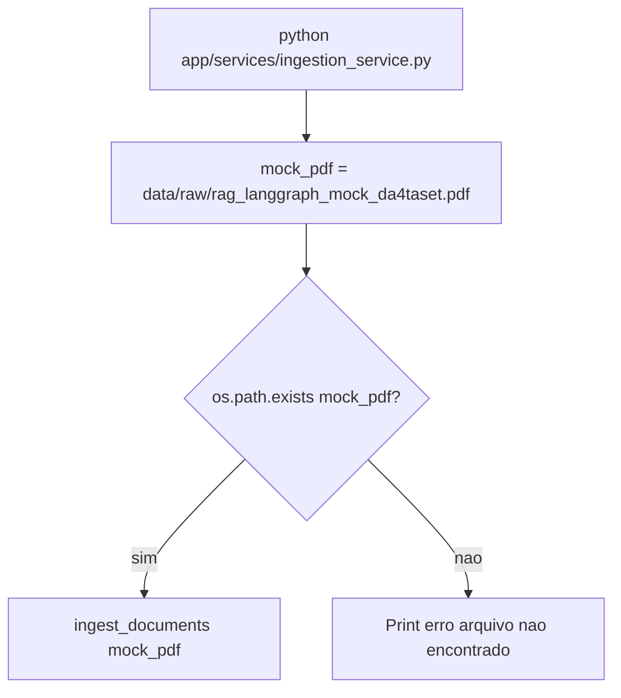
```mermaid
flowchart TD
    A["python app/services/ingestion_service.py"] --> B["mock_pdf = data/raw/rag_langgraph_mock_da4taset.pdf"]
    B --> C{os.path.exists mock_pdf?}
    C -->|sim| D[ingest_documents mock_pdf]
    C -->|nao| E[Print erro arquivo nao encontrado]
```

Observacao tecnica: o caminho no bloco `__main__` esta como `rag_langgraph_mock_da4taset.pdf`. Pelo nome, pode haver erro de digitacao em `da4taset`, mas isso foi apenas observado no codigo; nao foi alterado neste documento.

## 15. Fluxo de setup e dependencias

Arquivo: `setup.sh`

Responsabilidade: preparar ambiente, instalar dependencias e criar estrutura inicial de pastas/arquivos.

```mermaid
flowchart TD
    A[Executar setup.sh] --> B[Atualizar pip]
    B --> C[Instalar FastAPI, Uvicorn e utilitarios]
    C --> D[Instalar LangGraph, LangChain e pacotes relacionados]
    D --> E[Instalar parsing e embeddings auxiliares]
    E --> F[Instalar chromadb]
    F --> G[Criar estrutura de pastas]
    G --> H[app/api/endpoints]
    G --> I[app/core]
    G --> J[app/services]
    G --> K[app/models]
    G --> L[app/schemas]
    G --> M[app/graph/nodes]
    G --> N[app/graph/routes]
    G --> O[data/raw]
    G --> P[data/vectorstore]
    P --> Q[Criar arquivos iniciais com touch]
    Q --> R[pip freeze > requirements.txt]
    R --> S[Ambiente preparado]
```

Arquivo: `requirements.txt`

Responsabilidade: fixar dependencias instaladas. Pacotes centrais para o funcionamento observado:

- `fastapi`
- `uvicorn`
- `langgraph`
- `langchain`
- `langchain-core`
- `langchain-community`
- `langchain-google-genai` e/ou compatibilidade esperada pelo codigo: o codigo importa `langchain_google_genai`, mas esse pacote nao apareceu explicitamente na leitura do `requirements.txt`.
- `chromadb`
- `pydantic`
- `pydantic-settings`
- `pypdf`
- `langchain-text-splitters`

Observacao tecnica: o codigo importa `langchain_google_genai`, mas o `requirements.txt` lido nao mostrou uma linha `langchain-google-genai==...`. Se o pacote estiver instalado no ambiente por outro caminho, o projeto pode funcionar; se nao estiver, a importacao falhara.

## 16. Mapa por arquivo, classe e funcao

| Arquivo | Elemento | Tipo | Papel |
|---|---|---|---|
| `app/main.py` | `app` | objeto `FastAPI` | Aplicacao principal com titulo vindo de `settings.PROJECT_NAME`. |
| `app/main.py` | `read_root()` | funcao endpoint | Retorna mensagem simples em `GET /`. |
| `app/api/endpoints/chat.py` | `router` | `APIRouter` | Agrupa rotas de chat. |
| `app/api/endpoints/chat.py` | `chat_rag(question: str)` | endpoint async | Cria estado inicial, invoca LangGraph e serializa resposta. |
| `app/core/config.py` | `Settings` | classe Pydantic Settings | Define configuracoes do projeto, Gemini e Chroma Cloud. |
| `app/core/config.py` | `settings` | instancia | Carrega `.env` e disponibiliza configuracoes. |
| `app/core/config.py` | `get_chroma_client()` | funcao | Cria cliente Chroma Cloud sem cache local neste arquivo. |
| `app/graph/state.py` | `GraphState` | `TypedDict` | Contrato do estado trafegado entre os nos LangGraph. |
| `app/graph/workflow.py` | `workflow` | `StateGraph` | Define nos e arestas do workflow. |
| `app/graph/workflow.py` | `app_graph` | grafo compilado | Objeto invocado pela API. |
| `app/graph/nodes/retrieve.py` | `retrieve(state)` | no LangGraph | Busca documentos no Chroma e calcula relevancia. |
| `app/graph/nodes/validate_context.py` | `validate_context(state)` | no LangGraph | Valida scores e decide se ha contexto suficiente. |
| `app/graph/nodes/fallback.py` | `fallback(state)` | no LangGraph | Exclui logicamente chunks rejeitados e prepara retry. |
| `app/graph/nodes/generate.py` | `generate(state)` | no LangGraph | Gera resposta com Gemini usando contexto aprovado. |
| `app/graph/nodes/no_answer.py` | `no_answer(state)` | no LangGraph | Retorna resposta segura apos esgotar tentativas. |
| `app/repositories/chroma_repository.py` | `_client` | cache global | Guarda cliente Chroma Cloud reutilizavel. |
| `app/repositories/chroma_repository.py` | `_collection` | cache global | Guarda collection Chroma reutilizavel. |
| `app/repositories/chroma_repository.py` | `get_chroma_client()` | funcao repository | Cria/reutiliza cliente Chroma Cloud. |
| `app/repositories/chroma_repository.py` | `get_chroma_collection(...)` | funcao repository | Cria/reutiliza collection pelo nome configurado. |
| `app/repositories/chroma_repository.py` | `get_vectorstore(embeddings)` | funcao repository | Cria `Chroma` para retrieval. |
| `app/repositories/chroma_repository.py` | `build_vectorstore_from_documents(...)` | funcao repository | Persiste documentos vetorizados no Chroma. |
| `app/services/ingestion_service.py` | `ingest_documents(pdf_path)` | service | Ingestao PDF -> chunks -> embeddings -> Chroma. |
| `app/services/ingestion_service.py` | bloco `if __name__ == "__main__"` | execucao direta | Tenta ingerir PDF mockado se existir. |
| `app/__init__.py` | vazio | marcador de pacote | Torna `app` um pacote Python. |
| `app/graph/__init__.py` | vazio | marcador de pacote | Torna `app.graph` um pacote Python. |
| `app/repositories/__init__.py` | vazio | marcador de pacote | Torna `app.repositories` um pacote Python. |
| `setup.sh` | comandos shell | script | Instala dependencias e cria estrutura base. |
| `requirements.txt` | dependencias | manifesto | Lista pacotes fixados do ambiente. |

## 17. Caminho completo de uma pergunta com contexto aprovado

```mermaid
flowchart TD
    A[Usuario pergunta] --> B["POST /api/chat question"]
    B --> C[chat_rag]
    C --> D[initial_state]
    D --> E[app_graph.invoke]
    E --> F[retrieve tentativa 1]
    F --> G[Chroma retorna documentos e scores]
    G --> H[retrieve filtra excluded_doc_ids vazio]
    H --> I[retrieve calcula has_relevant_context true]
    I --> J[validate_context confirma true]
    J --> K[generate]
    K --> L[Prompt RAG com contexto]
    L --> M[Gemini gera resposta]
    M --> N[final_state generation]
    N --> O[chat_rag monta JSON]
    O --> P[Cliente recebe resposta]
```

## 18. Caminho completo de uma pergunta com fallback e sucesso posterior

```mermaid
flowchart TD
    A[Usuario pergunta] --> B[chat_rag cria initial_state]
    B --> C[retrieve tentativa 1]
    C --> D[docs e scores fracos]
    D --> E[validate_context false]
    E --> F[fallback]
    F --> G[adiciona chunk_id rejeitado em excluded_doc_ids]
    G --> H{retrieval_attempt 1 < max 3?}
    H -->|sim| I[retrieve tentativa 2]
    I --> J[filtra chunks rejeitados]
    J --> K[novos docs e scores]
    K --> L[validate_context true]
    L --> M[generate]
    M --> N[final_state com resposta]
```

## 19. Caminho completo de uma pergunta sem contexto suficiente

```mermaid
flowchart TD
    A[Usuario pergunta] --> B[retrieve tentativa 1]
    B --> C[validate_context false]
    C --> D[fallback rejeita lote 1]
    D --> E[retrieve tentativa 2]
    E --> F[validate_context false]
    F --> G[fallback rejeita lote 2]
    G --> H[retrieve tentativa 3]
    H --> I[validate_context false]
    I --> J[fallback rejeita lote 3]
    J --> K{retrieval_attempt 3 < max 3?}
    K -->|nao| L[no_answer]
    L --> M[resposta negativa segura]
    M --> N[JSON com contexto_aprovado false]
```

## 20. Observacoes tecnicas e pontos de atencao

1. O pacote `langchain_google_genai` e usado em `retrieve.py`, `generate.py` e `ingestion_service.py`. Na leitura do `requirements.txt`, nao apareceu uma linha explicita `langchain-google-genai==...`.
2. Ha duas funcoes chamadas `get_chroma_client`: uma em `app/core/config.py` e outra em `app/repositories/chroma_repository.py`. O fluxo principal usa a do repository para retrieval e ingestao.
3. `get_chroma_collection` usa `Depends`, padrao comum de FastAPI, mas nao foi observado endpoint usando essa dependency diretamente.
4. `validate_context` repete a regra objetiva calculada em `retrieve`. Isso nao quebra o fluxo; apenas centraliza a decisao final no no de validacao.
5. A ingestao nao faz deduplicacao explicita. Reingerir o mesmo PDF pode acumular documentos duplicados na collection, dependendo do comportamento do `Chroma.from_documents` e dos IDs gerados internamente.
6. O bloco `__main__` de `ingestion_service.py` aponta para `data/raw/rag_langgraph_mock_da4taset.pdf`; no diretorio `data` lido, so apareceu `data/vectorstore`, sem `data/raw`.
7. O prompt em `generate.py` exige resposta baseada apenas no contexto, mas a garantia final depende do comportamento do modelo LLM.
8. O endpoint `chat_rag` recebe `question` como parametro simples da funcao. Em FastAPI, isso tende a ser tratado como parametro de query quando nao ha schema/body Pydantic definido.

## 21. Resumo final do funcionamento

```mermaid
flowchart LR
    A[Ingestao previa] --> B[PDF]
    B --> C[Chunks com chunk_id]
    C --> D[Embeddings Gemini]
    D --> E[Chroma Cloud]

    F[API /api/chat] --> G[GraphState]
    G --> H[LangGraph]
    H --> I[Retrieve no Chroma]
    E --> I
    I --> J[Validacao por score]
    J -->|aprovado| K[Geracao Gemini]
    J -->|reprovado| L[Fallback com exclusao de chunk_id]
    L -->|retry disponivel| I
    L -->|retry esgotado| M[No answer]
    K --> N[Resposta JSON]
    M --> N
```

