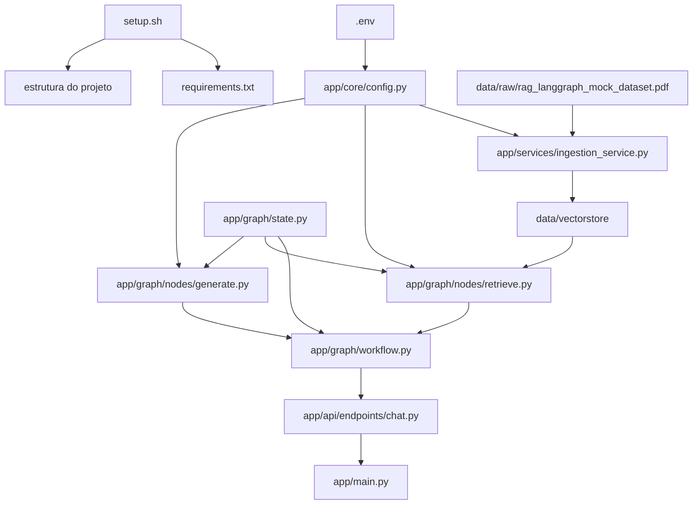
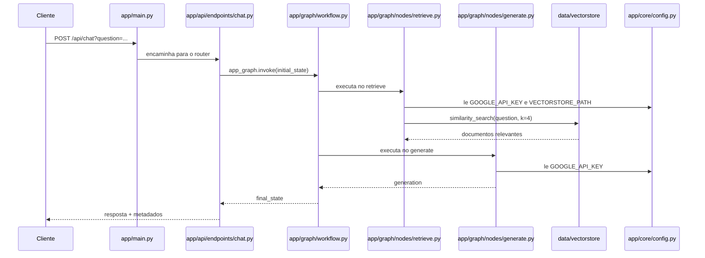

# Workflow e Relacoes do Projeto RAG

Navegacao: [Indice](./00_indice.md) | [Estrutura](./01_estrutura_e_links.md) | [Workflow detalhado](./03_workflow_detalhado.md)

## Visao geral

Esta nota mostra como os arquivos do projeto se relacionam entre si e como o fluxo RAG percorre a aplicacao.

O projeto pode ser entendido em quatro blocos:
- bootstrap e ambiente;
- configuracao central;
- ingestao e base vetorial;
- API + LangGraph + geracao.

---

## Workflow ponta a ponta

1. `setup.sh` prepara o ambiente, cria a estrutura inicial e registra dependencias em `requirements.txt`.
2. `.env` deveria fornecer a chave usada por `app/core/config.py`.
3. `app/services/ingestion_service.py` le o PDF em `data/raw/` e grava vetores em `data/vectorstore/`.
4. `app/graph/state.py` define o contrato do estado compartilhado do workflow.
5. `app/graph/nodes/retrieve.py` consulta o Chroma persistido e recupera documentos relevantes.
6. `app/graph/nodes/generate.py` usa o contexto recuperado para gerar a resposta com Gemini.
7. `app/graph/workflow.py` conecta `retrieve -> generate` e compila o grafo.
8. `app/api/endpoints/chat.py` recebe a pergunta HTTP, monta o estado inicial e invoca o grafo.
9. `app/main.py` registra o endpoint no FastAPI e expoe a API.

A explicacao expandida de como o estado se move entre os nos esta em [Workflow detalhado do projeto RAG](./03_workflow_detalhado.md).
A protecao recomendada contra contexto fraco esta em [Validacao de contexto recuperado](./04_validacao_contexto_recuperado.md).

---

## Diagrama geral

---

## Diagrama do request HTTP

---

## Relacao entre os arquivos

### 1. Bootstrap e ambiente

- [setup.sh](./arquivos/raiz/setup.sh.md) cria diretorios e arquivos base.
- [requirements.txt](./arquivos/raiz/requirements.txt.md) registra o estado das dependencias instaladas.
- [.env](./arquivos/raiz/env.md) armazena configuracao sensivel.

### 2. Configuracao central

- [app/core/config.py](./arquivos/app/core/config.py.md) e o ponto central de configuracao.
- Ele e consumido por [app/main.py](./arquivos/app/main.py.md), [app/services/ingestion_service.py](./arquivos/app/services/ingestion_service.py.md), [app/graph/nodes/retrieve.py](./arquivos/app/graph/nodes/retrieve.py.md) e [app/graph/nodes/generate.py](./arquivos/app/graph/nodes/generate.py.md).

### 3. Ingestao e persistencia vetorial

- [data/raw/rag_langgraph_mock_dataset.pdf](./arquivos/data/raw/rag_langgraph_mock_dataset.pdf.md) e o insumo bruto de teste.
- [app/services/ingestion_service.py](./arquivos/app/services/ingestion_service.py.md) transforma o PDF em chunks e embeddings.
- O resultado e persistido em `data/vectorstore/`, que depois e lido por [app/graph/nodes/retrieve.py](./arquivos/app/graph/nodes/retrieve.py.md).

### 4. Estado e orquestracao

- [app/graph/state.py](./arquivos/app/graph/state.py.md) define as chaves `question`, `documents` e `generation`.
- [app/graph/workflow.py](./arquivos/app/graph/workflow.py.md) usa esse contrato para montar o grafo.
- [app/graph/nodes/retrieve.py](./arquivos/app/graph/nodes/retrieve.py.md) e [app/graph/nodes/generate.py](./arquivos/app/graph/nodes/generate.py.md) sao os nos executados no workflow.
- A evolucao recomendada para esse bloco esta detalhada em [Workflow detalhado do projeto RAG](./03_workflow_detalhado.md) e [Validacao de contexto recuperado](./04_validacao_contexto_recuperado.md).

### 5. Exposicao HTTP

- [app/api/endpoints/chat.py](./arquivos/app/api/endpoints/chat.py.md) faz a ponte entre FastAPI e LangGraph.
- [app/main.py](./arquivos/app/main.py.md) registra o router e sobe a aplicacao HTTP.

---

## Ligacao arquivo a arquivo

### `setup.sh`
- cria a estrutura onde todos os demais arquivos vivem;
- alimenta [requirements.txt](./arquivos/raiz/requirements.txt.md).

### `.env`
- deveria alimentar [app/core/config.py](./arquivos/app/core/config.py.md).

### `app/core/config.py`
- fornece configuracao para [app/main.py](./arquivos/app/main.py.md);
- fornece configuracao para [app/services/ingestion_service.py](./arquivos/app/services/ingestion_service.py.md);
- fornece configuracao para [app/graph/nodes/retrieve.py](./arquivos/app/graph/nodes/retrieve.py.md);
- fornece configuracao para [app/graph/nodes/generate.py](./arquivos/app/graph/nodes/generate.py.md).

### `app/services/ingestion_service.py`
- consome [data/raw/rag_langgraph_mock_dataset.pdf](./arquivos/data/raw/rag_langgraph_mock_dataset.pdf.md);
- usa [app/core/config.py](./arquivos/app/core/config.py.md);
- gera a base lida por [app/graph/nodes/retrieve.py](./arquivos/app/graph/nodes/retrieve.py.md).

### `app/graph/state.py`
- tipa o estado usado por [app/graph/workflow.py](./arquivos/app/graph/workflow.py.md);
- tipa o estado usado por [app/graph/nodes/retrieve.py](./arquivos/app/graph/nodes/retrieve.py.md);
- tipa o estado usado por [app/graph/nodes/generate.py](./arquivos/app/graph/nodes/generate.py.md).

### `app/graph/workflow.py`
- conecta [app/graph/nodes/retrieve.py](./arquivos/app/graph/nodes/retrieve.py.md) e [app/graph/nodes/generate.py](./arquivos/app/graph/nodes/generate.py.md);
- expoe `app_graph` para [app/api/endpoints/chat.py](./arquivos/app/api/endpoints/chat.py.md);
- hoje implementa um fluxo linear, explicado em [Workflow detalhado do projeto RAG](./03_workflow_detalhado.md).

### `app/api/endpoints/chat.py`
- recebe requests HTTP;
- chama [app/graph/workflow.py](./arquivos/app/graph/workflow.py.md);
- retorna o resultado ao cliente;
- e registrado por [app/main.py](./arquivos/app/main.py.md).

---

## Dependencias criticas do fluxo

- Sem a ingestao previa, [app/graph/nodes/retrieve.py](./arquivos/app/graph/nodes/retrieve.py.md) nao encontra base vetorial util.
- Sem configuracao valida, [app/services/ingestion_service.py](./arquivos/app/services/ingestion_service.py.md), [app/graph/nodes/retrieve.py](./arquivos/app/graph/nodes/retrieve.py.md) e [app/graph/nodes/generate.py](./arquivos/app/graph/nodes/generate.py.md) podem falhar.
- Ha um desalinhamento entre `.env` e [app/core/config.py](./arquivos/app/core/config.py.md): o arquivo de ambiente usa `GEMINI_API_KEY`, enquanto o codigo le `GOOGLE_API_KEY`.
- O desenho atual nao valida a qualidade do contexto antes da geracao; veja [Validacao de contexto recuperado](./04_validacao_contexto_recuperado.md).

---

## Leitura recomendada para entender o projeto

1. [01_estrutura_e_links.md](./01_estrutura_e_links.md)
2. [app/core/config.py](./arquivos/app/core/config.py.md)
3. [app/services/ingestion_service.py](./arquivos/app/services/ingestion_service.py.md)
4. [app/graph/state.py](./arquivos/app/graph/state.py.md)
5. [app/graph/nodes/retrieve.py](./arquivos/app/graph/nodes/retrieve.py.md)
6. [app/graph/nodes/generate.py](./arquivos/app/graph/nodes/generate.py.md)
7. [app/graph/workflow.py](./arquivos/app/graph/workflow.py.md)
8. [Workflow detalhado do projeto RAG](./03_workflow_detalhado.md)
9. [Validacao de contexto recuperado](./04_validacao_contexto_recuperado.md)
10. [app/api/endpoints/chat.py](./arquivos/app/api/endpoints/chat.py.md)
11. [app/main.py](./arquivos/app/main.py.md)
