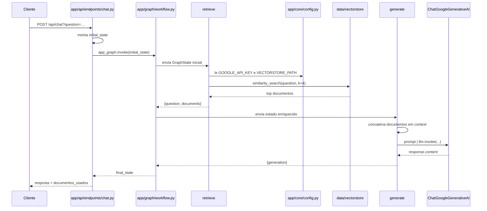

# Workflow Detalhado do Projeto RAG

Navegacao: [Indice](./00_indice.md) | [Workflow e relacoes](./02_workflow_relacoes.md) | [Validacao de contexto recuperado](./04_validacao_contexto_recuperado.md)

## Objetivo desta nota

Esta nota detalha como o workflow do projeto realmente executa uma pergunta do inicio ao fim.

O foco aqui nao e apenas dizer que existe um grafo com `retrieve` e `generate`, mas explicar:
- qual estado entra no grafo;
- como esse estado e alterado em cada no;
- em que momento o Chroma e o Gemini participam;
- quais pre-condicoes precisam existir para o fluxo funcionar;
- onde estao os riscos tecnicos do desenho atual.

## Arquivos centrais do workflow

Os arquivos que formam o fluxo principal sao:
- [app/api/endpoints/chat.py](./arquivos/app/api/endpoints/chat.py.md)
- [app/graph/workflow.py](./arquivos/app/graph/workflow.py.md)
- [app/graph/state.py](./arquivos/app/graph/state.py.md)
- [app/graph/nodes/retrieve.py](./arquivos/app/graph/nodes/retrieve.py.md)
- [app/graph/nodes/generate.py](./arquivos/app/graph/nodes/generate.py.md)
- [app/core/config.py](./arquivos/app/core/config.py.md)

## Modelo mental correto do fluxo

O workflow atual pode ser resumido assim:

`cliente -> FastAPI -> chat endpoint -> LangGraph -> retrieve -> generate -> resposta`

Mas esse resumo esconde detalhes importantes. O fluxo real depende de estado compartilhado e de uma base vetorial ja persistida em disco.

## Estrutura do grafo

Em [app/graph/workflow.py](./arquivos/app/graph/workflow.py.md), o projeto cria um `StateGraph(GraphState)` e registra dois nos:
- `retrieve`
- `generate`

As arestas sao lineares:
- `START -> retrieve`
- `retrieve -> generate`
- `generate -> END`

Isso significa que o workflow nao possui:
- ramificacao condicional;
- retries;
- fallback estruturado;
- validacao de qualidade do contexto antes de gerar;
- checkpoint persistente do estado.

## Estado compartilhado do workflow

O contrato do estado esta em [app/graph/state.py](./arquivos/app/graph/state.py.md). Hoje o estado tem 3 chaves:
- `question`
- `documents`
- `generation`

Interpretacao tecnica de cada campo:
- `question`: pergunta original recebida da API e usada como query do retrieval e como pergunta do prompt final.
- `documents`: lista de `Document` recuperados do Chroma.
- `generation`: resposta textual produzida pela LLM.

O LangGraph trabalha passando esse dicionario entre os nos. Cada no le parte do estado e devolve um dicionario parcial que e mesclado ao estado atual.

## Fase 1: entrada HTTP

A entrada do fluxo ocorre em [app/api/endpoints/chat.py](./arquivos/app/api/endpoints/chat.py.md).

Quando o cliente chama `POST /api/chat`, a rota:
1. recebe `question`;
2. monta o `initial_state`;
3. chama `app_graph.invoke(initial_state)`;
4. devolve ao cliente a `generation` e os metadados dos documentos usados.

Estado inicial construido pela rota:

```python
{
  "question": question,
  "documents": [],
  "generation": ""
}
```

Esse detalhe importa porque o endpoint nao conversa diretamente com Chroma nem com Gemini. Ele delega tudo ao grafo compilado.

## Fase 2: entrada no LangGraph

Quando `app_graph.invoke(initial_state)` e chamado, o LangGraph inicia a execucao a partir do `START` e segue a aresta definida para `retrieve`.

Nesse ponto, o grafo ainda nao gerou nenhuma resposta. Ele apenas recebeu o estado inicial e comecou a aplicar a sequencia de nos definida em [app/graph/workflow.py](./arquivos/app/graph/workflow.py.md).

## Fase 3: no `retrieve`

O no `retrieve`, em [app/graph/nodes/retrieve.py](./arquivos/app/graph/nodes/retrieve.py.md), faz a parte de recuperacao semantica.

Passos reais executados por ele:
1. le `question` do estado;
2. cria um objeto `GoogleGenerativeAIEmbeddings` com `models/embedding-001`;
3. abre o banco vetorial Chroma em `settings.VECTORSTORE_PATH`;
4. executa `similarity_search(question, k=4)`;
5. devolve os documentos encontrados para o estado.

Estado conceitual antes do no:

```python
{
  "question": "Como funciona o projeto?",
  "documents": [],
  "generation": ""
}
```

Estado parcial retornado pelo no:

```python
{
  "question": "Como funciona o projeto?",
  "documents": [Document(...), Document(...), ...]
}
```

Depois do merge do LangGraph, o estado passa a conter os documentos recuperados.

## O que o `retrieve` pressupoe

Esse no so funciona corretamente se estas condicoes forem verdadeiras:
- existe `GOOGLE_API_KEY` valida carregada em [app/core/config.py](./arquivos/app/core/config.py.md);
- o diretorio `data/vectorstore` contem uma base persistida utilizavel;
- a base foi criada com embeddings compativeis com o mesmo modelo ou com uma configuracao equivalente;
- o processo tem acesso ao diretorio persistido.

Se a base vetorial estiver vazia ou inexistente, o retrieval nao tera contexto util para entregar ao proximo no.

## Fase 4: no `generate`

O no `generate`, em [app/graph/nodes/generate.py](./arquivos/app/graph/nodes/generate.py.md), recebe o estado enriquecido com `documents`.

Passos reais executados por ele:
1. le `question`;
2. le `documents`;
3. concatena `page_content` de todos os documentos em uma string unica chamada `context`;
4. monta um `ChatPromptTemplate` com instrucoes de RAG;
5. instancia `ChatGoogleGenerativeAI` com `gemini-1.5-flash`;
6. invoca a chain `prompt | llm`;
7. devolve `{"generation": response.content}`.

Estado conceitual recebido pelo no:

```python
{
  "question": "Como funciona o projeto?",
  "documents": [Document(...), Document(...)],
  "generation": ""
}
```

Estado parcial retornado:

```python
{
  "generation": "Resposta final baseada no contexto"
}
```

Apos o merge, o estado final passa a conter:
- a pergunta original;
- os documentos recuperados;
- a resposta gerada.

## Fase 5: retorno ao endpoint

Quando o no `generate` termina, o grafo segue para `END`. O `invoke()` devolve o estado final para a rota HTTP.

A rota em [app/api/endpoints/chat.py](./arquivos/app/api/endpoints/chat.py.md) le esse estado e responde com:
- `resposta`: `final_state["generation"]`
- `documentos_usados`: lista de `metadata` dos documentos

Isso fecha o ciclo do request.

## Diagrama de sequencia detalhado



## Onde o workflow ainda e fraco

Do ponto de vista tecnico, o uso de LangGraph aqui ainda e basico. Os principais limites atuais sao:
- o fluxo sempre segue para `generate`, mesmo que o retrieval tenha trazido contexto ruim;
- nao ha score de relevancia salvo no estado;
- nao ha no de validacao de contexto;
- nao ha fallback quando nao ha base suficiente para responder com seguranca;
- nao ha memoria de conversa;
- nao ha timeout ou tratamento dedicado de falhas por etapa.

Na pratica, isso significa que o sistema pode gerar resposta mesmo quando o contexto nao e defensavel.

## Evolucao recomendada do workflow

A evolucao mais util para este projeto e transformar o desenho linear em um fluxo com validacao:

`START -> retrieve -> validate_context -> generate | fallback -> END`

Esse desenho permite:
- salvar score de retrieval no estado;
- avaliar se o contexto e suficiente;
- bloquear geracao quando o contexto for fraco;
- responder com seguranca quando nao houver base confiavel.

A explicacao detalhada dessa verificacao esta em [Validacao de contexto recuperado](./04_validacao_contexto_recuperado.md).

## Resumo tecnico

O workflow atual usa LangGraph como um orquestrador de duas etapas:
1. recuperar contexto do Chroma;
2. gerar resposta com Gemini.

A API apenas prepara o estado inicial e consome o estado final. O comportamento inteligente da aplicacao depende da qualidade do `retrieve` e do prompt aplicado em `generate`.

## Notas relacionadas

- [Workflow e relacoes do projeto](./02_workflow_relacoes.md)
- [Validacao de contexto recuperado](./04_validacao_contexto_recuperado.md)
- [LangGraph e Workflow](./estudos/08_langgraph_e_workflow.md)
- [Retrieval](./estudos/06_retrieval.md)
- [Prompt RAG e geracao](./estudos/07_prompt_rag_e_geracao.md)
